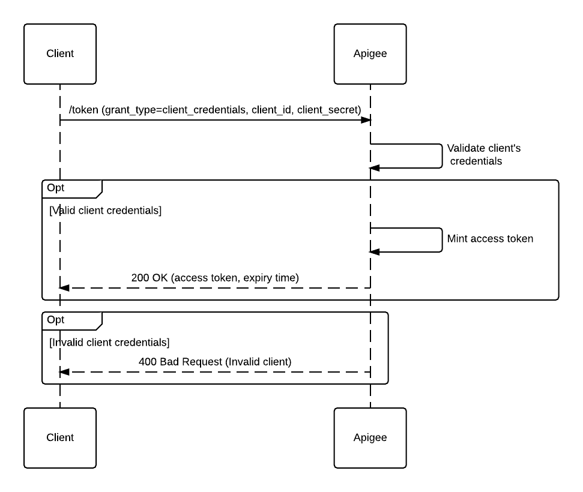
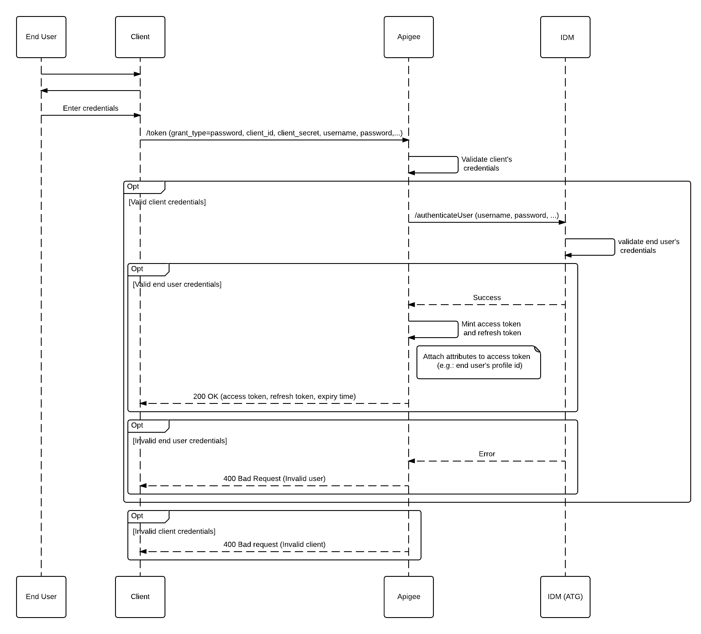

# Lab 3.02 - API Security using OAuthV2

## Introduction

We will be implementing an Identity API that will support the client credentials grant, the password grant and the refresh token grant. In addition to this, we will be protecting the API implemented on the first day of the training using OAuth V2. BBD tests will be written for both APIs. 

## OAuth V2 Grants Implemented

### Client Credentials Grant

### Password Grant

